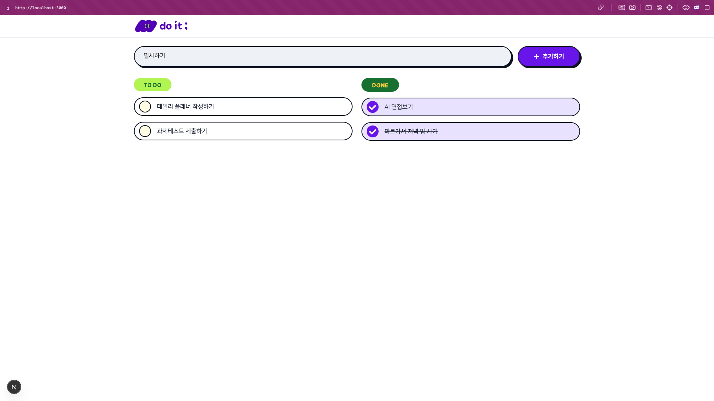
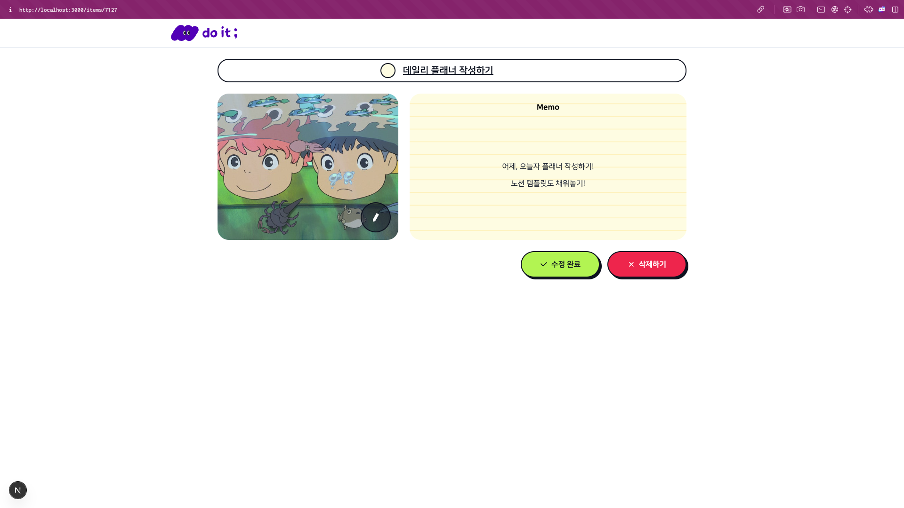

# 📝 do it : 할 일 목록 (Todo List)

> 코드잇 프론트엔드 단기심화 과정 과제 테스트  
> 할 일을 효율적으로 관리할 수 있는 Todo 서비스입니다.

---

## 🚀 프로젝트 소개

- Next.js와 TypeScript를 기반으로 한 **할 일 관리 웹 애플리케이션**
- 진행 중인 할 일과 완료된 할 일을 구분하여 보여주는 **체계적 인터페이스**
- 할 일 추가/수정/삭제/완료 처리와 **메모 및 이미지 첨부 기능**까지 지원
- **반응형 웹 디자인**을 적용하여 다양한 디바이스에서도 최적의 사용 경험 제공

---

## 📸 시연 이미지

| 메인 페이지                            | 상세 페이지                                |
| -------------------------------------- | ------------------------------------------ |
|  |  |

---

## 🛠 사용 기술

- **Next.js 13+**
- **React** (Hook 기반 상태관리)
- **TypeScript**
- **Tailwind CSS**
- **Axios** (API 통신)
- **Vercel** (배포)

---

## 디렉토리 구조

```
src/
├── api/ # API 호출 함수 정의 (todo.ts, image.ts)
├── components/ # 공용 컴포넌트 및 Todo 컴포넌트 분리
│ ├── common/ # 버튼 등 재사용 가능한 컴포넌트
│ ├── icon/ # 반응형에 따라 다르게 보여지는 icon 컴포넌트
│ ├── layout/ # Header 등 레이아웃에 재사용 가능한 컴포넌트
│ └── todo/ # EmptyState, CheckListItem 등 재사용 가능한 UI 컴포넌트
├── pages/
│ ├── index.tsx # 메인 페이지
│ └── items/[id].tsx# 상세 페이지
├── types/ # TodoData 타입 정의
└── styles/ # Tailwind 설정
```

---

## 주요 기능

### 메인 페이지 (/)

- 할 일 조회
- 할 일 추가 (입력창 + 버튼 또는 Enter)
- 할 일 완료 처리 (낙관적 UI 업데이트)
- 완료 상태 해제
- EmptyState 처리

### 상세 페이지 (/items/{itemId})

- 할 일 이름 수정
- 진행 상태 수정
- 메모 입력 및 수정
- 이미지 첨부 (최대 1개 / 영어 이름 / 5MB 이하)
- 수정 사항 저장 후 메인 페이지로 이동
- 삭제 기능

---

## 반응형 지원

- 모바일, 태블릿, 데스크탑까지 **전 구간 반응형 구현**
- `Tailwind CSS`의 `sm`, `md`, `lg` 유틸리티 활용

---

## 컬러 시스템

디자인 시안에 맞춘 컬러 설정 완료  
커스텀 색상 클래스: `bg-slate1`, `bg-violet6`, `bg-slate2`, `text-slate9` 등

---

## 설치 및 실행

```bash
# 1. 의존성 설치
npm install

# 2. 개발 서버 실행
npm run dev

# 3. 브라우저에서 접속
http://localhost:3000
```
---

## 제출 정보
- 배포 링크: [Vercel(로그인 인증 미필요)](https://codeit-todo-three.vercel.app/)

